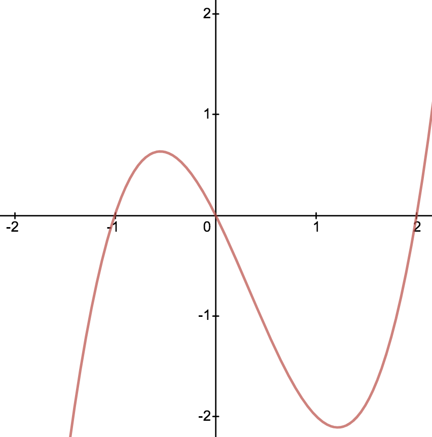

# Color Wheel Graph

[What is it?](https://en.wikipedia.org/wiki/Domain_coloring)

[Why did I make it?](#why-did-i-make-this)

[How do I use it?](#usage)

[API docs](#api)

## Why did I make this?

If you have taken a class in elementary functions, you are probably familiar with the idea that you can draw a line on a sheet of paper to represent a function. This is true as long as the input (x) is a value on the real number line and the output (y) is a value on the real number line.

y = x<sup>3</sup> - x<sup>2</sup> - 2x


There are tons of tools around for making these sorts of graphs, but I recently found myself wanting to graph another type of function.

I wanted explain why a popular youtube video is utter nonsense and part of that explanation required graphing a function where the input is a complex number and the output is a complex number. Naturally I felt the need to make a graphing calculator that I could use for my demonstration.

## Installation

```bash
npm install --save color-wheel-graph
```

## Usage


```JavaScript
import React from 'react';
import Graph from 'color-wheel-graph/lib/Graph';

const IdentityGraph = () => <Graph
  resolution={101}
  cellSize={Math.floor(window.outerWidth / 100)}
  windowMaxReal={2}
  windowMaxImaginary={2}
  outputMaxReal={2}
  outputMaxImaginary={2}
  func={z => z}
/>;
```

### API

`resolution` (Number): the number of cells on each side of the viewing square will be rendered.

`cellSize` (Number): the number of pixels wide and tall an individual cell will be.

`windowMaxReal` (Number): sets the largest real part of an input that will appear in the graph's domain. The negative of this value will also be the smallest real part that appears in the graph's domain.

`windowMaxImaginary` (Number): sets the largest imaginary part that will appear in the graph's domain. The negative of this value will also be the smallest imaginary part that appears in the graph's domain.

`outputMaxReal` (Number): sets the value of the real part at which colors will have a maximal R (in its RGB color vector).

`outputMaxImaginary` (Number): sets the value of the imaginary part at which colors will have a maximal B (in its RGB color vector).

`func` (ComplexNumber => ComplexNumber): this is a function that consumes and returns a member of the ComplexNumber class (see [complex-calculator](https://www.npmjs.com/package/complex-calculator)).
